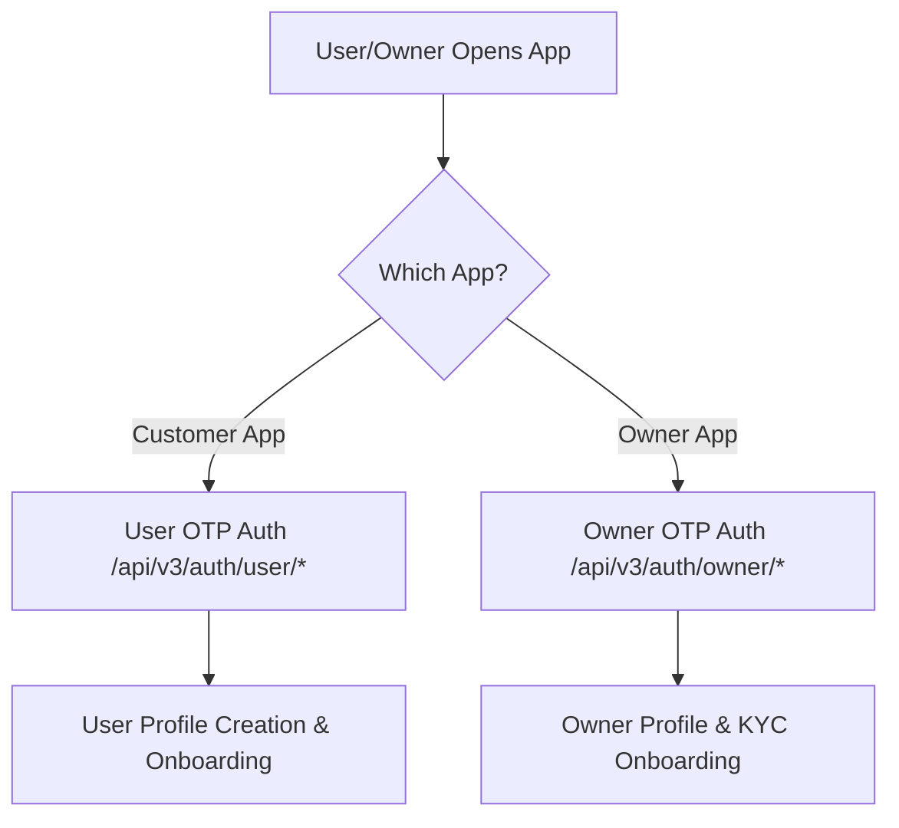
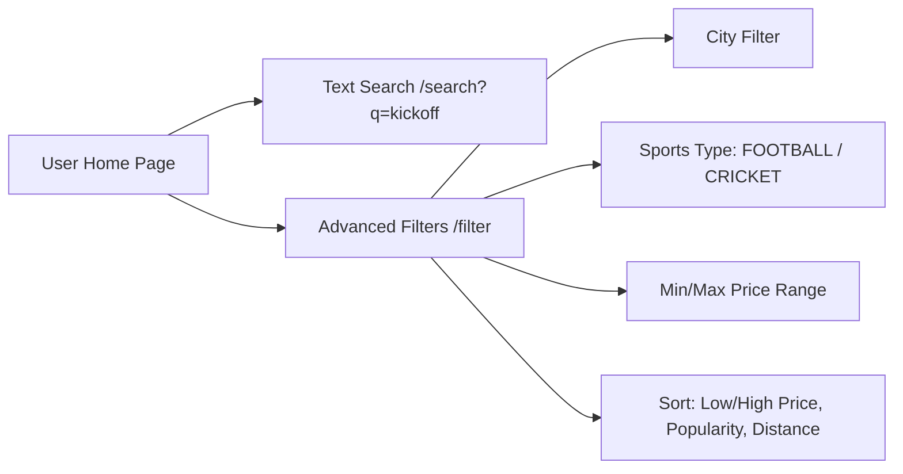
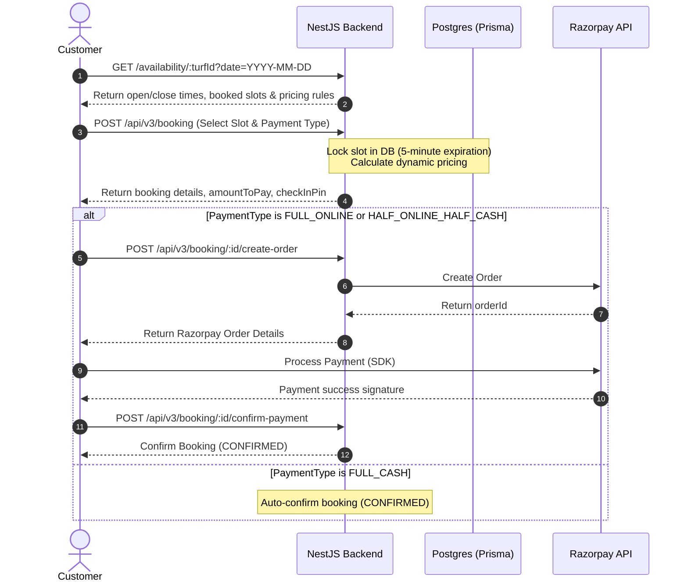
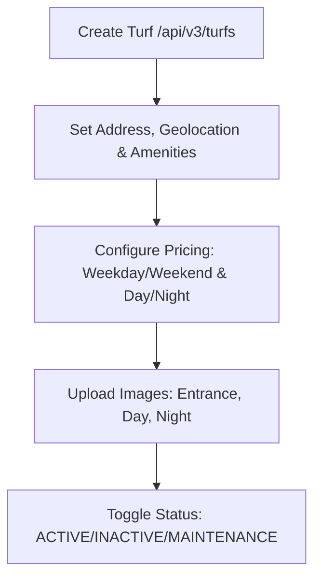
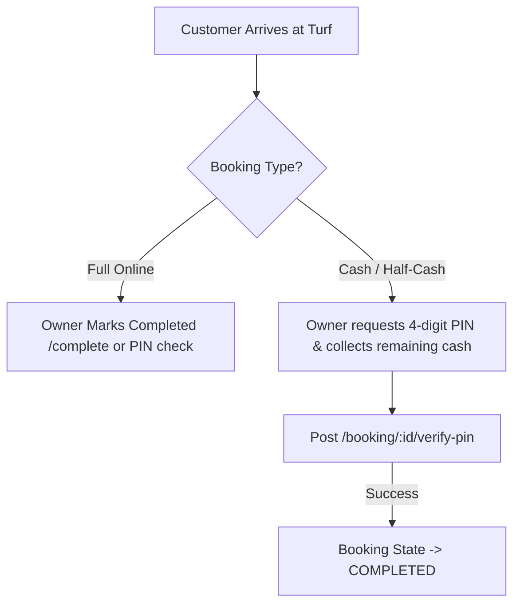
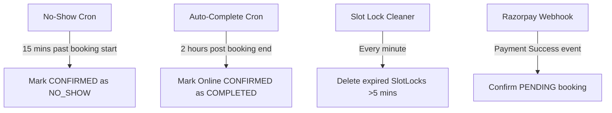

# Turfsy Application Flow Documentation

This document provides a comprehensive overview of the application flow for both the **User (Customer)** and the **Owner** applications in the Turfsy ecosystem. It covers onboarding, turf discovery, booking lifecycles, payment/split rules, analytics, gamification, and background automation systems.

---

## 🏛️ System-Wide Architecture & Roles

Turfsy differentiates roles based on the endpoint accessed. There is no central role selection endpoint. Instead, the apps communicate with distinct auth boundaries:
*   **User App Endpoints**: Prefix `/api/v3/auth/user/*` (Role: `USER`)
*   **Owner App Endpoints**: Prefix `/api/v3/auth/owner/*` (Role: `OWNER`)

---

## 📱 1. User (Customer) App Flow

The User application is designed for turf discovery, real-time availability checks, booking reservation, automated split-payments, and gamified engagement.

### A. Authentication & Onboarding Flow
1.  **OTP Login**: User inputs an Indian phone number.
    *   `POST /api/v3/auth/user/login` (Sends OTP, expires in 60s).
2.  **Verify OTP**: User submits the 6-digit OTP.
    *   `POST /api/v3/auth/user/verify-otp`
    *   Returns `accessToken`, `role: "USER"`, and a boolean `isNewUser`.
3.  **Username Availability Check**: If `isNewUser` is true, the user selects a handle.
    *   `GET /api/v3/user-profile/check-availability?username=john_doe`
4.  **Create Profile**: User submits personal details along with geographic coordinates.
    *   `POST /api/v3/user-profile` (Name, email, DOB, gender, preferred sport, lat/lng, city, state, pincode).
5.  **Address & Payment Additions**:
    *   Add exact address details (house number, society name, landmark, road name) via `PATCH /api/v3/user-profile/address` (merged into a single string by the backend).
    *   Upload profile avatar via `POST /api/v3/user-profile/upload-avatar`.
    *   Add payment UPI ID via `POST /api/v3/user-profile/payment-details`.

---

### B. Discovery, Search, and Filtering Flow
Users search and discover active turfs based on location, sports category, pricing, and ratings.

1.  **User Home Dashboard**: Feeds sections such as `Recent Views`, `Popular Turfs` (most saved/bookmarked), and `Nearby Turfs` based on user coordinates.
    *   `GET /api/v3/user-home`
2.  **Text Search**: Performs partial, case-insensitive matches on turf names.
    *   `GET /api/v3/turfs/search?q=kickoff`
3.  **Structured Filtration & Sorting**:
    *   `GET /api/v3/turfs/filter`
    *   **Parameters**: `city`, `sportsType` (`CRICKET`, `FOOTBALL`), `minPrice`, `maxPrice`, `sortBy` (`price_low`, `price_high`, `popular`, `distance`, `newest`), and `userLat`/`userLng`.
    *   *Note: If coordinates are sent, the backend appends calculated `distanceKm` to each turf.*
4.  **Bookmark / Save Turf**: Users can bookmark a turf for quick access.
    *   `POST /api/v3/saved-turfs` (Toggle save status).

---

### C. Booking & Payment Lifecycle Flow
The core of the application handles reserving slots, paying deposits, and generating check-in credentials.

#### 1. Availability Inspection
*   `GET /api/v3/booking/availability/:turfId?date=2026-07-05`
*   Returns already-booked slots and current day's pricing schema (Day/Night pricing, Weekend premiums).

#### 2. Booking Creation & Slot Lock
*   `POST /api/v3/booking`
*   **Body**: `turfId`, `bookingDate`, `startTime`, `endTime`, `durationMins`, `paymentType`, `playersCount`, `notes`.
*   **Actions**:
    1.  Calculates price based on weekday/weekend and day/night rules.
    2.  Acquires a **5-minute Database Slot Lock** (`SlotLock` model).
    3.  Generates a **4-digit checkInPin** for validation.
    4.  Returns `amountToPay` and `depositAmount`.

#### 3. Payment Modes & Rules
*   **`FULL_ONLINE`**: 100% deposit paid immediately. Remaining balance = ₹0.
*   **`HALF_ONLINE_HALF_CASH`**: 50% deposit paid online; remaining 50% paid in-person to the owner.
*   **`FULL_CASH`**: 0% deposit online (auto-confirms booking); 100% paid in-person to the owner.

#### 4. Payment Execution
*   Create Order: `POST /api/v3/booking/:bookingId/create-order` (gets Razorpay order parameters).
*   Verify / Confirm Payment: `POST /api/v3/booking/:bookingId/confirm-payment` (submits signature details).

#### 5. Booking Splitwise Flow (Group Splitting)
Allows booking creators (Lead Users) to split costs with other registered players.
1.  **Access Split Screen**: Lead user opens booking and clicks "Split in Team".
2.  **Fetch / Initialize Split**: `GET /api/v3/booking/:bookingId/split`.
3.  **Add Players**: `POST /api/v3/booking/:bookingId/split/players` with `{ "usernames": ["player1", "player2"] }`.
    *   System recalculates equal split slices.
4.  **Custom Fraction Allocation (Optional)**: Lead user modifies amounts directly.
    *   `PATCH /api/v3/booking/:bookingId/split/custom-amounts` (sum must equal total cost).
5.  **Finalize & Lock**: `POST /api/v3/booking/:bookingId/split/trigger`
    *   Locks the split configuration (`isSplitDone = true`). Players are notified and pay the lead user offline or via personal UPI.
6.  **Settle Status**: Lead User marks player payment status (`PAID` / `PENDING`) using `PATCH /api/v3/booking/split/players/:playerId/status`.

---

### D. Post-Booking & Gamification Flow
1.  **Cancellation & Refund**:
    *   `PATCH /api/v3/booking/:bookingId/cancel` (with cancellation reason).
    *   **Refund Logic**: Evaluates turf policy (e.g. must cancel >2 hours before start). Processes partial automated refund (e.g., 75%) if eligible.
2.  **Rebooking**:
    *   `POST /api/v3/booking/:bookingId/rebook` (Clones parameters from an old booking, allowing quick selection of new date/time).
3.  **User Gamification & Leaderboard**:
    *   `GET /api/v3/user-gamification/overall`
    *   **Points Rules**: Earns **10 points** per completed match hour.
    *   **Streak Calculation**: Completing a booking increment streak by `+1` (max once per day). A **5-day grace period** is permitted; if inactive for >5 days, the streak decreases by 1.
    *   **Nudges**: Dynamic nudges appear based on rank and play status (e.g., *"Play today to keep your streak 🔥"*).
    *   **Leaderboards**: Fetch rankings by points, matches played, or hours played.

---

## 🏟️ 2. Owner App Flow

The Owner application is designed for business-side operations, KYC verification, turf asset listing, booking supervision, check-in validation, and financial intelligence.

### A. Authentication, KYC & Business Profile Onboarding
1.  **OTP Login**: Owner registers/logs in.
    *   `POST /api/v3/auth/owner/login` -> `POST /api/v3/auth/owner/verify-otp`.
    *   Returns auth object with `role: "OWNER"`.
2.  **Create Profile**:
    *   `POST /api/v3/ownerProfile` (Submit name, email, contact number. Contact number must match login phone).
3.  **KYC Upload**: Owner uploads Aadhar card details for platform verification.
    *   `PATCH /api/v3/ownerProfile` (updates Aadhar details, bank account, IFSC code, and avatar).
4.  **Configure Payout Settings**:
    *   `POST /api/v3/ownerProfile/payment-details` (submit preferred business UPI ID).

---

### B. Turf Asset Creation & Management
Owners list and control turf availability, pricing, images, and parameters.

1.  **Create Turf Listing**:
    *   `POST /api/v3/turfs` (multipart form upload).
    *   Sets physical properties (name, dimensions/size, sport type, geolocation, opening/closing hours, minimum slot duration, amenities).
2.  **Price Matrix Configuration**:
    *   Weekday Day Price
    *   Weekday Night Price
    *   Weekend Day Price
    *   Weekend Night Price
    *   Cancellation parameters (hours buffer and refund percentage).
3.  **Turf Image Multi-Upload**:
    *   `POST /api/v3/turfs/:turfId/images` (Supports uploading `entrance`, `dayTurf`, and `nightTurf` file streams up to 5MB).
    *   Single replacements: `PATCH /api/v3/turfs/:turfId/upload-image/:type` (`type` = `entrance` | `dayTurf` | `nightTurf`).
4.  **Asset Status Control**:
    *   Toggle turf status (Active, Inactive, Maintenance) via `PATCH /api/v3/turfs/:turfId/status`.

---

### C. Booking Oversight & Check-in Verification Flow
Owners verify user check-ins when players arrive at the ground.

1.  **Check-in PIN Verification**:
    *   `POST /api/v3/booking/:bookingId/verify-pin`
    *   **Actions**: The owner inputs the 4-digit PIN presented by the player. If correct, this verifies the booking, collects remaining cash balances, and marks status as `COMPLETED`.
2.  **Manual Completion**:
    *   `PATCH /api/v3/booking/:bookingId/complete`
    *   Used for fully online bookings where players show up and start playing without entering a PIN.
3.  **Filtered Booking Feed**:
    *   `GET /api/v3/booking/owner/bookings-filtered?time=today&status=upcoming`
    *   Allows owners to see upcoming schedules for the day.

---

### D. Business Intelligence & Deep Analytics Flow
Owners monitor operational revenues, peaks, and booking patterns.

1.  **Master Dashboard Stat Feed**:
    *   `GET /api/v3/owner-home/dashboard`
    *   Serves the complete landing state: daily/monthly/overall revenue, booking counts (upcoming, completed, cancellations, no-shows), average booking values, peak playing hours, payment mode split, and top-performing turfs.
2.  **Deep Analytics Module**:
    *   `GET /api/v3/owner-analytics/overall`
    *   Retrieves aggregated historical performance for custom date ranges, providing granular data on cancellation rates, no-show ratios, and volume charts.
3.  **Reporting Export**:
    *   `GET /api/v3/booking/owner/analytics/csv` or `.../pdf` (Downloads compiled business sheets).

---

## ⚙️ 3. Background Services & Automation (Crons & Webhooks)

To ensure consistency in database states, several background automation scripts operate continuously:

1.  **Razorpay Webhook handler**:
    *   `POST /api/v3/booking/razorpay/webhook`
    *   Validates signatures directly from Razorpay. Confirms the booking status to `CONFIRMED` if the client application fails to send the confirmation.
2.  **No-Show Cron**:
    *   `POST /api/v3/booking/cron/no-shows`
    *   Queries bookings that are `CONFIRMED` but whose play-time started >15 minutes ago without a PIN verification check-in. Auto-updates status to `NO_SHOW`.
3.  **Auto-Complete Cron**:
    *   `POST /api/v3/booking/cron/auto-complete`
    *   Queries `CONFIRMED` bookings (for fully-online payments) and auto-completes them 2 hours after their scheduled end time.
4.  **Slot Lock Cleaner**:
    *   Monitors `SlotLock` records. If a booking remains `PENDING` without confirmation for more than 5 minutes, the database slot lock is removed, releasing the time slot back to public availability.
