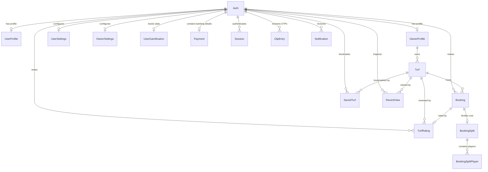

# Turfsy Backend Database Schema Document

This document defines the database architecture, relations, indexing strategies, and enumerations used in the Turfsy server platform. The database runs on **PostgreSQL (Supabase)** and is accessed via **Prisma ORM**.

---

## 1. Entity-Relationship (ER) Diagram

The following diagram maps the structural relationships between the tables in the Turfsy database.



---

## 2. Model Schema Reference

### 1. `Auth` (Security & Credentials Root)
The central auth table storing contact numbers, push notifications metadata, and user accounts.
*   **Table Name**: `Auth`
*   **Fields**:
    | Field Name | Type | Constraints | Description |
    | :--- | :--- | :--- | :--- |
    | `id` | `String` | `@id`, `@default(uuid())` | Primary key identifier. |
    | `phone` | `String` | `@unique` | Verified Indian mobile number. |
    | `role` | `Role` | `@default(USER)` | Role enum (`USER` \| `OWNER`). |
    | `isVerified` | `Boolean` | `@default(false)` | Flag marking SMS OTP verification status. |
    | `isActive` | `Boolean` | `@default(true)` | Active status flag. |
    | `expoPushToken`| `String?` | Optional | Registered mobile device notification token. |
    | `createdAt` | `DateTime`| `@default(now())` | Creation date. |
    | `updatedAt` | `DateTime`| `@updatedAt` | Auto-updated modification date. |
    | `deletedAt` | `DateTime?`| Optional | Flag for soft delete workflows. |
*   **Performance Indexes**:
    *   `@@index([phone])` (Hot index for auth lookup searches)
    *   `@@index([role])` (Index for role categorization filtering)

---

### 2. `UserProfile` (Customer Profile Details)
Stores player preferences, addresses, and physical coordinates.
*   **Table Name**: `UserProfile`
*   **Fields**:
    | Field Name | Type | Constraints | Description |
    | :--- | :--- | :--- | :--- |
    | `id` | `String` | `@id`, `@default(uuid())` | Primary key identifier. |
    | `authId` | `String` | `@unique`, FK (`Auth.id`) | Foreign key linking back to `Auth`. |
    | `username` | `String?` | `@unique` | Unique player handle (4-20 chars). |
    | `name` | `String?` | Optional | Full name of the player. |
    | `email` | `String?` | `@unique` | Contact email address. |
    | `avatarUrl` | `String?` | Optional | Supabase storage bucket file link. |
    | `dob` | `DateTime?`| Optional | Date of birth. |
    | `gender` | `Gender?` | Optional | Gender enum selection. |
    | `preferredSport`| `SportsType?`| Optional | Preferred sport (`FOOTBALL` \| `CRICKET`). |
    | `currentLat` | `Float?` | Optional | Geolocation latitude coordinate. |
    | `currentLng` | `Float?` | Optional | Geolocation longitude coordinate. |
    | `address` | `String?` | Optional | Concatenated address description. |
    | `city` | `String?` | Optional | City name. |
    | `state` | `String?` | Optional | State name. |
    | `pincode` | `String?` | Optional | Area postal code. |
*   **Performance Indexes**:
    *   `@@index([username])` (Lookup index for search additions in split-bookings)

---

### 3. `OwnerProfile` (Business Details)
Stores business details and verification metrics for turf owners.
*   **Table Name**: `OwnerProfile`
*   **Fields**:
    | Field Name | Type | Constraints | Description |
    | :--- | :--- | :--- | :--- |
    | `id` | `String` | `@id`, `@default(uuid())` | Primary key identifier. |
    | `authId` | `String` | `@unique`, FK (`Auth.id`) | Foreign key linking back to `Auth`. |
    | `name` | `String?` | Optional | Owner's full name. |
    | `email` | `String?` | `@unique` | Business email. |
    | `contactNumber`| `String?` | Optional | Verified business phone number. |
    | `avatarUrl` | `String?` | Optional | Avatar photo url. |
    | `isKycVerified`| `Boolean` | `@default(false)` | Flag indicating manual admin verification approval. |
*   **Performance Indexes**:
    *   `@@index([authId])` (Lookup index for session validations)

---

### 4. `Turf` (Facility & Asset Listings)
Maintains specifications, sizes, amenities, geolocations, and dynamic pricing models for grounds.
*   **Table Name**: `Turf`
*   **Fields**:
    | Field Name | Type | Constraints | Description |
    | :--- | :--- | :--- | :--- |
    | `id` | `String` | `@id`, `@default(uuid())` | Primary key identifier. |
    | `ownerProfileId`| `String` | FK (`OwnerProfile.id`) | Foreign key linking to owner listing parent. |
    | `name` | `String` | Required | Name of the turf ground. |
    | `description` | `String?` | Optional | Text description of the facility. |
    | `sportsType` | `SportsType`| Required | Turf category enum (`FOOTBALL` \| `CRICKET`). |
    | `turfSize` | `String` | Required | Dimension metrics (e.g., "5v5", "7v7"). |
    | `status` | `TurfStatus`| `@default(ACTIVE)` | Active status flag. |
    | `address` | `String` | Required | Physical street address. |
    | `city` | `String` | Required | City name (exact text). |
    | `pincode` | `String` | Required | Postal code. |
    | `lat` | `Float` | Required | Geographic coordinates (latitude). |
    | `lng` | `Float` | Required | Geographic coordinates (longitude). |
    | `openTime` | `String` | Required | Daily open hour (format: "HH:MM"). |
    | `closeTime` | `String` | Required | Daily close hour (format: "HH:MM"). |
    | `minSlotDurationMins`| `Int` | Required | Minimum booking interval (usually 60). |
    | `groundDayUrl` | `String?` | Optional | Day view photo storage path. |
    | `groundNightUrl`| `String?` | Optional | Night view photo storage path. |
    | `entranceUrl` | `String?` | Optional | Entrance photo storage path. |
    | `floodLights` | `Boolean` | `@default(false)` | Amenity flag. |
    | `parking` | `Boolean` | `@default(false)` | Amenity flag. |
    | `washroom` | `Boolean` | `@default(false)` | Amenity flag. |
    | `changingRoom` | `Boolean` | `@default(false)` | Amenity flag. |
    | `drinkingWater`| `Boolean` | `@default(false)` | Amenity flag. |
    | `weekdayDayPrice`| `Float` | Required | Base price for weekday daytime slots. |
    | `weekdayNightPrice`| `Float`| Required | Base price for weekday nighttime slots. |
    | `weekendDayPrice`| `Float` | Required | Base price for weekend daytime slots. |
    | `weekendNightPrice`| `Float`| Required | Base price for weekend nighttime slots. |
    | `cancellationAllowedBeforeHours`| `Int`| `@default(2)` | Minimum buffer hours required to cancel. |
    | `cancellationRefundPercentage`| `Float`| `@default(75.0)` | Refund percentage return rate. |
*   **Performance Indexes**:
    *   `@@index([status, city])` (Speeds up city queries on discovery lists)
    *   `@@index([status, sportsType])` (Speeds up category searches)
    *   `@@index([ownerProfileId, deletedAt])` (Used for owner dashboard listing queries)

---

### 5. `Booking` (Reservations & Ledger)
Tracks transactional scheduling data, payments, and check-in statuses.
*   **Table Name**: `bookings`
*   **Fields**:
    | Field Name | Type | Constraints | Description |
    | :--- | :--- | :--- | :--- |
    | `id` | `String` | `@id`, `@default(uuid())` | Primary key identifier. |
    | `userId` | `String` | FK (`Auth.id`) | Foreign key linking to customer Auth record. |
    | `turfId` | `String` | FK (`Turf.id`) | Foreign key linking to Turf resource. |
    | `bookingDate` | `DateTime`| `@db.Date` | Scheduled play date. |
    | `startTime` | `String` | Required | Start time slot (format: "HH:MM"). |
    | `endTime` | `String` | Required | End time slot (format: "HH:MM"). |
    | `durationMins` | `Int` | Required | Total minutes (e.g., 60, 120). |
    | `bookingStatus`| `BookingStatus`| `@default(PENDING)` | Current booking state enum. |
    | `paymentStatus`| `PaymentStatus`| `@default(PENDING)` | Current payment status enum. |
    | `paymentType` | `PaymentType`| Required | Selected payment mode enum. |
    | `amount` | `Float` | Required | Total booking fee. |
    | `depositAmount`| `Float` | `@default(0)` | Required deposit amount. |
    | `razorpayOrderId`| `String?`| Optional | External payment transaction order reference. |
    | `razorpayPaymentId`| `String?`| Optional | External payment reference. |
    | `qrNonce` | `String?` | `@unique` | Nonce for single-use QR validation. |
*   **Performance Indexes**:
    *   `@@unique([turfId, bookingDate, startTime])` (Enforces booking uniqueness to prevent duplicate reservations)
    *   `@@index([userId, bookingDate, bookingStatus])` (Fast index for "My Bookings" lists)
    *   `@@index([turfId, bookingStatus])` (Used for owner calendar status checking)

---

### 6. `SlotLock` (Concurrency Lock Registry)
Handles real-time slot-locking processes.
*   **Table Name**: `slot_locks`
*   **Fields**:
    | Field Name | Type | Constraints | Description |
    | :--- | :--- | :--- | :--- |
    | `id` | `String` | `@id`, `@default(uuid())` | Primary key identifier. |
    | `userId` | `String` | Required | ID of the player requesting the lock. |
    | `turfId` | `String` | Required | ID of the target turf ground. |
    | `bookingDate` | `DateTime`| `@db.Date` | Target booking date. |
    | `startTime` | `String` | Required | Start slot time ("HH:MM"). |
    | `endTime` | `String` | Required | End slot time ("HH:MM"). |
    | `expiresAt` | `DateTime`| Required | Expiration timestamp (created + 5 minutes). |
    | `bookingId` | `String?` | `@unique` | Optional reference linking back to Booking. |
*   **Performance Indexes**:
    *   `@@index([expiresAt])` (Used by cleanup cron jobs to remove expired locks)

---

### 7. `BookingSplit` & `BookingSplitPlayer` (Cost-Splitting Ledgers)
Manages group payments.
*   **Table Name**: `booking_splits` & `booking_split_players`
*   **Split Fields**:
    | Field Name | Type | Constraints | Description |
    | :--- | :--- | :--- | :--- |
    | `id` | `String` | `@id`, `@default(uuid())` | Primary key identifier. |
    | `bookingId` | `String` | `@unique`, FK (`Booking.id`)| Links directly to the source booking. |
    | `totalAmount` | `Float` | Required | Total amount to divide. |
    | `isSplitDone` | `Boolean` | `@default(false)` | Flag locking split configuration once finalized. |
*   **Player Fields**:
    | Field Name | Type | Constraints | Description |
    | :--- | :--- | :--- | :--- |
    | `id` | `String` | `@id`, `@default(uuid())` | Primary key identifier. |
    | `splitId` | `String` | FK (`BookingSplit.id`)| Links to split configuration. |
    | `username` | `String` | Required | Unique teammate username. |
    | `amount` | `Int` | `@default(0)` | Individual amount owed. |
    | `status` | `SplitPlayerStatus`| `@default(PENDING)` | Payment status enum (`PENDING` \| `PAID`). |

---

### 8. `UserGamification` (Customer Engagement Tracker)
*   **Table Name**: `user_gamification`
*   **Fields**:
    | Field Name | Type | Constraints | Description |
    | :--- | :--- | :--- | :--- |
    | `id` | `String` | `@id`, `@default(uuid())` | Primary key identifier. |
    | `authId` | `String` | `@unique`, FK (`Auth.id`) | Links to player auth record. |
    | `streak` | `Int` | `@default(0)` | Number of consecutive active days. |
    | `points` | `Int` | `@default(0)` | Total points earned. |
    | `totalMatches` | `Int` | `@default(0)` | Total completed matches. |
    | `totalHours` | `Float` | `@default(0)` | Total hours played. |
*   **Performance Indexes**:
    *   `@@index([points])` (Fast indexing for leaderboard ranking lists)

---

## 3. Database Enumerations (Enums)

Enums are used to enforce data integrity on status codes and settings:

```text
enum Role {
  USER
  OWNER
}

enum Gender {
  MALE
  FEMALE
  OTHER
  PREFER_NOT_TO_SAY
}

enum SportsType {
  FOOTBALL
  CRICKET
}

enum TurfStatus {
  ACTIVE
  INACTIVE
  MAINTENANCE
}

enum BookingStatus {
  PENDING
  CONFIRMED
  COMPLETED
  CANCELLED
  NO_SHOW
}

enum PaymentStatus {
  PENDING
  SUCCESS
  FAILED
  REFUNDED
}

enum PaymentType {
  FULL_ONLINE
  HALF_ONLINE_HALF_CASH
  FULL_CASH
}

enum PayoutMethod {
  UPI
  BANK
}

enum SplitPlayerStatus {
  PENDING
  PAID
}
```
