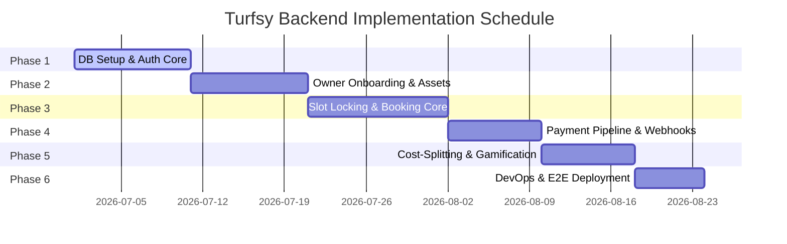
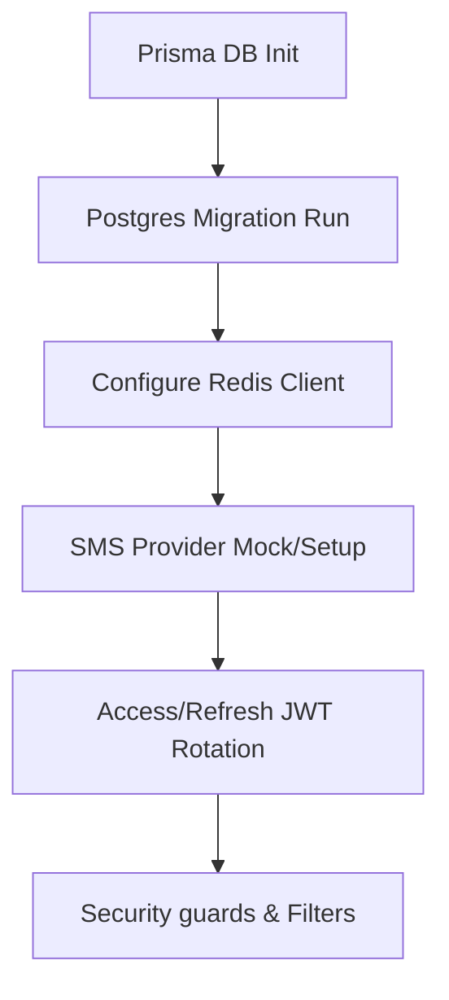
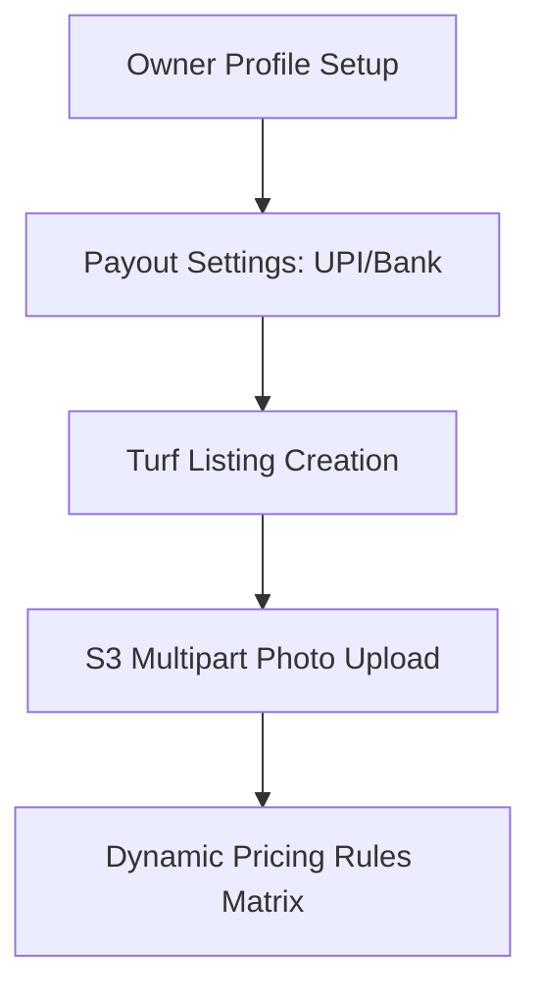
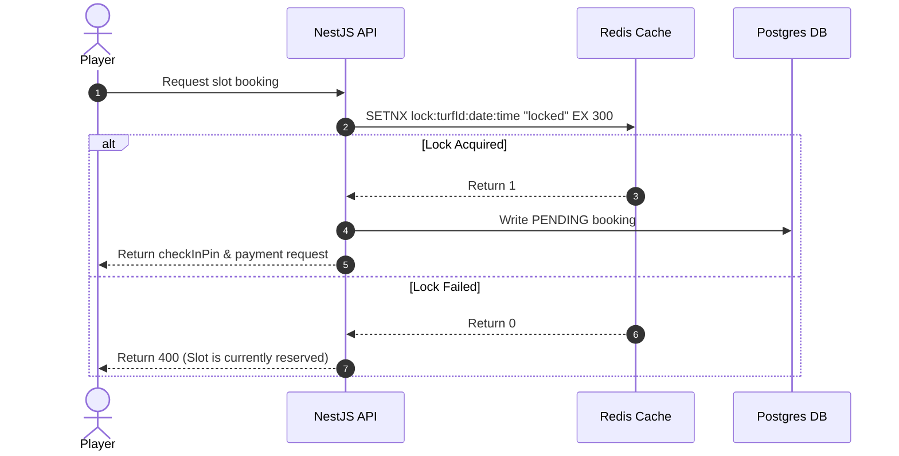
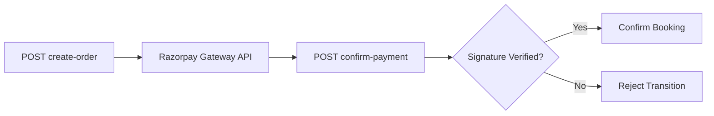
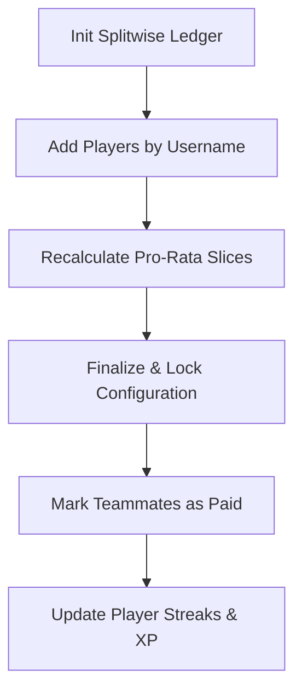
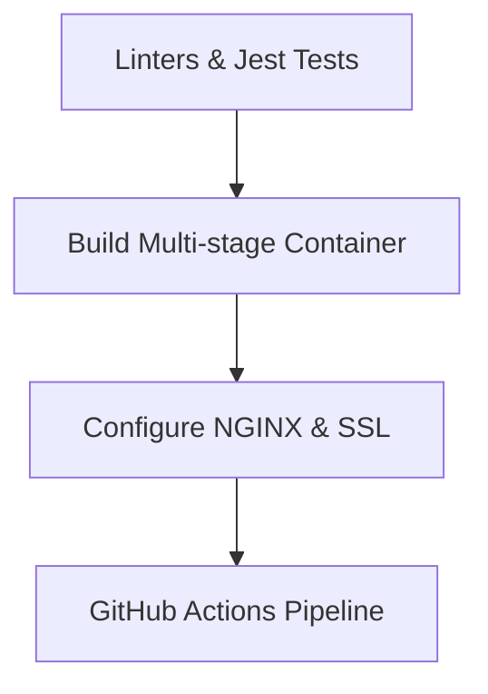

# Turfsy Implementation Plan

This document details the step-by-step implementation plan for the Turfsy backend services and database infrastructure. It is designed to guide developers through sequential phases, establishing testing criteria, validation protocols, and integration flows at each step.

---

## 1. Development Roadmap & Milestones

The implementation is divided into six logical phases to ensure that features are built on validated dependencies.

---

## 2. Phase-by-Phase Execution Details

### Phase 1: Database Setup & Authentication Core
Focuses on configuring the database schema, Prisma clients, Redis servers, and SMS OTP verification flows.

*   **Tasks**:
    1.  Initialize Prisma with PostgreSQL credentials in `.env`.
    2.  Run `prisma db push` to generate local TypeScript types.
    3.  Set up Redis client for managing verification state and temporary rate limits.
    4.  Build the OTP helper and mock SMS service.
    5.  Implement Access/Refresh token creation and JWT rotation routes.
    6.  Create NestJS custom guards (`RolesGuard`, `JwtAuthGuard`) and security filters.
*   **Verification Gate**:
    *   Assert that `/auth/user/login` stores a 6-digit PIN in Redis with a 60-second TTL.
    *   Verify that request headers containing expired JWT tokens are blocked with `401 Unauthorized`.

---

### Phase 2: Owner Onboarding & Turf Asset Engine
Allows owners to register profiles, establish business settings, and configure dynamic pricing matrices.

*   **Tasks**:
    1.  Build owner registration routes (`POST /ownerProfile` and validation).
    2.  Implement business profile updates and banking payout configs (`PATCH /ownerProfile`).
    3.  Create the turf configuration controller (`POST /turfs`).
    4.  Configure Supabase Storage multipart S3 file stream pipes (entrance, day, night images).
    5.  Implement the pricing matrix (Day/Night time dividers, Weekend premiums).
*   **Verification Gate**:
    *   Newly registered owner status must default to `PENDING` (must block turf activations).
    *   Verify image uploads are blocked for files exceeding 5MB or invalid mime types.

---

### Phase 3: Slot Locking & Booking Core
Enforces database slot locks, sets up schedule calendars, and configures status transition workers.

*   **Tasks**:
    1.  Create the slot availability calendar API (`GET /booking/availability/:turfId`).
    2.  Implement the Redis `SETNX` slot lock middleware.
    3.  Build the booking validation logic (checking parameters against turf close times).
    4.  Generate check-in PIN numbers and assign booking records.
    5.  Implement background cron tasks for cleaning up expired locks and auto-completing matches.
*   **Verification Gate**:
    *   Confirm concurrent requests for the same turf slot return a success status for the first connection and a `400 Bad Request` for the second.

---

### Phase 4: Payment Pipeline & Webhooks
Integrates Razorpay payments, signature verifications, and background webhook captures.

*   **Tasks**:
    1.  Install the Razorpay Node SDK.
    2.  Implement order creation route (`POST /booking/:bookingId/create-order`) and map parameters.
    3.  Build the cryptographic signature validation service.
    4.  Create the public webhook capture controller (`POST /booking/razorpay/webhook`).
    5.  Implement transaction logging and database updates.
*   **Verification Gate**:
    *   Verify signature checks fail when request payloads are modified.
    *   Assert that webhook events update `PENDING` bookings to `CONFIRMED` and delete corresponding Redis slot lock keys.

---

### Phase 5: Cost-Splitting & Gamification Engine
Calculates team divisions, updates XP stats, and manages leaderboards.

*   **Tasks**:
    1.  Create booking split ledger routes (`GET` and `POST /booking/:id/split/players`).
    2.  Implement validations to check teammate usernames against registered profiles.
    3.  Build the pro-rata fraction adjustment service.
    4.  Implement split locking triggers and status updates (`PATCH /split/players/:id/status`).
    5.  Create the gamification stats worker (streak updates, point awards, nudges, leaderboard sorting).
*   **Verification Gate**:
    *   Ensure the sum of split amounts matches the total booking cost.
    *   Verify that completed matches increment player streaks by `+1` (up to once per day).

---

### Phase 6: DevOps, Testing & VPS Deployments
Sets up container environments, reverse proxies, and CI/CD pipelines.

*   **Tasks**:
    1.  Write Jest end-to-end integration tests.
    2.  Create production Dockerfiles and `docker-compose.yml` configs.
    3.  Configure NGINX reverse proxies and set up Let's Encrypt SSL certificates.
    4.  Build the GitHub Actions CI/CD deployment pipeline.
    5.  Verify API health endpoints on the production server.
*   **Verification Gate**:
    *   Verify all Jest checks pass before container builds.
    *   Ensure the production health route returns `200 OK` with system statistics.

---

## 3. Detailed Endpoint Implementation Order

Implement endpoints in the following order to ensure dependencies are resolved:

1.  **System Infrastructure**: Setup Prisma, Postgres, and Redis connections.
2.  **Authentication**: OTP routes, JWT creation, token refresh, and login status lookups.
3.  **Player Profile**: Username checks, profile creation, and address updates.
4.  **Owner Profile**: Business registration, payment, and payout preferences.
5.  **Turf Management**: Turf creation wizard, image storage configurations, and status controls.
6.  **Discovery Services**: Location-based filtering, text search, and bookmarks.
7.  **Availability Services**: Real-time calendar inspections and slot locking.
8.  **Booking Management**: Core reservation creation and status transition crons.
9.  **Payments**: Razorpay order generation, confirmation checks, and webhooks.
10. **Cost-Splitting**: Split ledgers, teammate additions, and custom updates.
11. **Gamification**: XP points, daily streaks, nudges, and leaderboards.
12. **Analytics**: Owner dashboard KPIs, filters, and analytics exports.
