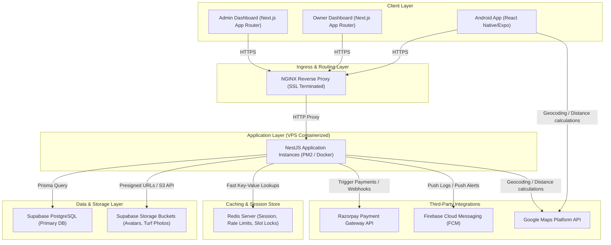
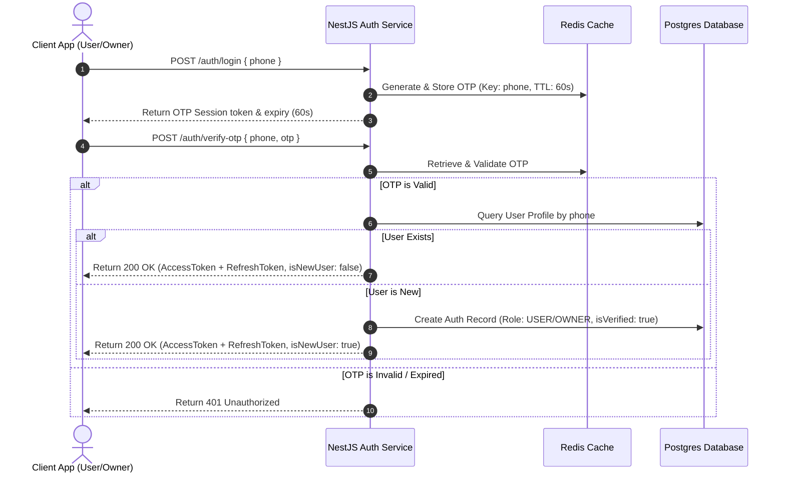
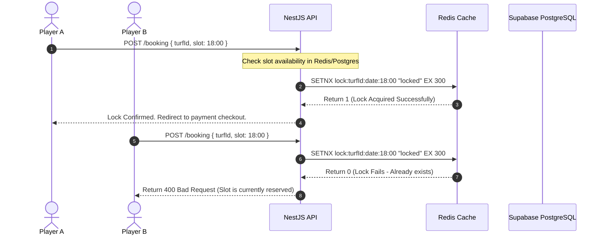
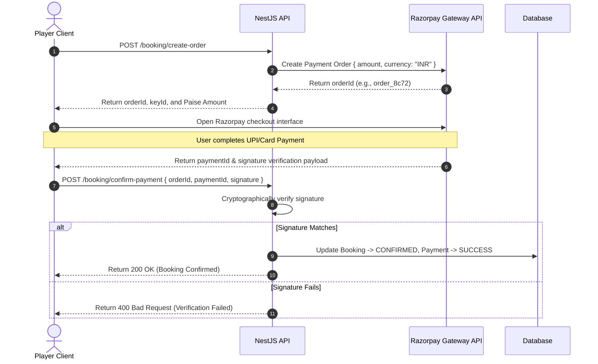
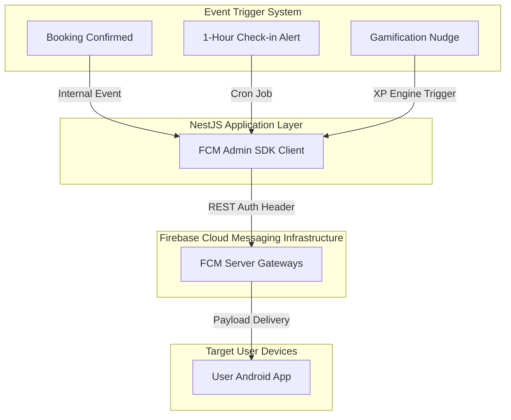
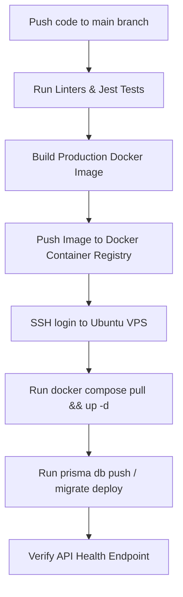

# System Architecture Document: Turfsy

**Document Title**: System Architecture Document (SAD) - Turfsy Smart Turf Booking Platform  
**Version**: 1.0.0  
**Document Status**: Final (Ready for Implementation)  
**Author**: Senior Technical Architect  
**Prepared Date**: June 30, 2026  

---

## 1. System Topology & Data Flow

Turfsy uses a client-server architecture. Clients (Android Player App, Owner Next.js Web Dashboard, and Admin Next.js Web Panel) connect to a central NestJS API Gateway. The backend manages state using Prisma ORM with a Supabase PostgreSQL database, handles file storage via Supabase Storage buckets, processes payments through Razorpay, and dispatches notifications via Firebase Cloud Messaging (FCM).



### Additional Technology Recommendation (Critical for Production Uptime)
*   **Redis**: Recommended for inclusion alongside the PostgreSQL database.
    *   **Why it is necessary**: Real-time slot locking requires sub-millisecond query execution. If database transaction table-locks are used for every slot selection under load, database thread-locks will occur. Redis serves as an in-memory database that handles 5-minute Slot Locks, IP rate-limiting, and temporary OTP sessions without adding read/write strain to the PostgreSQL instance.

---

## 2. Micro-level Module Architecture

### A. Backend Architecture (NestJS)

The backend follows a modular domain-driven layout using NestJS. Each module contains controller classes for routing, service classes for business logic, DTOs for request validation, and Prisma schema definitions.

```text
src/
├── common/
│   ├── decorators/         # @Roles(), @CurrentUser()
│   ├── filters/            # Global Exception Filters (SecurityExceptionFilter)
│   ├── guards/             # JwtAuthGuard, RolesGuard
│   ├── interceptors/       # ResponseSanitizerInterceptor
│   └── services/           # RateLimiterService, PaymentLoggerService
├── modules/
│   ├── auth/               # OTP login, session validation, JWT rotation
│   ├── booking/            # Reservation logic, slot-locks, transactional payments
│   ├── owner-analytics/    # Owner KPI aggregations & exports
│   ├── owner-home/         # Owner main calendar feeds & stats
│   ├── owner-profile/      # Owner registration & banking settings
│   ├── saved-turfs/        # User favorites / bookmarks
│   ├── turfs/              # Turf listings, details, status toggles
│   ├── upload/             # Supabase storage upload piping
│   ├── user-gamification/  # Streak calculations, points, leaderboards
│   ├── user-home/          # User homepage content structures
│   ├── user-profile/       # User profile details and usernames
│   └── user-settings/      # User alert preferences
├── prisma/                 # Prisma client setups & schema files
├── app.module.ts           # Main app compilation root
└── main.ts                 # App bootstrap entry point
```

---

### B. Mobile Player Client Architecture (React Native)

The mobile codebase uses React Native (Expo) organized by features, with Zustand for global UI state and React Query for asynchronous API data caching.

```text
src/
├── api/                    # React Query mutations & query custom hooks
├── components/             # Reusable UI widgets (TurfCard, CustomButton, InputField)
├── constants/              # Color tokens, fonts, theme layouts
├── features/               # Domain scopes
│   ├── auth/               # OTP inputs, verify screens
│   ├── booking/            # Slot selections, checkout details, splits
│   ├── gamification/       # Streak feeds, XP charts, leaderboards
│   └── search/             # Discovery maps, advanced filter options
├── navigation/             # Stack/Tab configurations via React Navigation
├── store/                  # Zustand slices (userProfileStore, bookingStore)
└── styles/                 # Tailwind style configurations (NativeWind)
```

#### State & Query Management Strategy
*   **TanStack Query (React Query)**: Handles all server data. Local cache duration is set to 30 seconds for availability lists to minimize data staleness.
*   **Zustand**: Manages local client state, such as active session details, local coordinate caches, user preferences, and in-progress split payment configurations.

---

### C. Owner & Admin Dashboard Architecture (Next.js)

Both portals use the Next.js App Router with React, Tailwind CSS, and Shadcn UI.

```text
src/
├── app/
│   ├── (auth)/             # Login pages, OTP gates
│   ├── dashboard/          # Layout and pages
│   │   ├── bookings/       # Calendar grid view
│   │   ├── profile/        # Business profiles & bank payout setups
│   │   └── analytics/      # Financial tables, PDF exports
│   └── layout.tsx          # Global providers (Auth, Theme, QueryClient)
├── components/             # Shadcn primitives (Table, Button, Dialog, Card)
├── hooks/                  # Custom hooks (useAuth, useDashboardStats)
├── lib/                    # Shared library setups (Prisma Client, Axios wrapper)
└── types/                  # TypeScript interface mappings
```

#### Server-Side Rendering (SSR) vs. Client-Side Rendering (CSR) Strategy
*   **Next.js Server Actions / SSR**: Used to pre-render the framework structure of dashboards, login interfaces, and static business profile screens to speed up initial page loads.
*   **Client-Side Rendering (CSR)**: Used for interactive components, such as dynamic calendar grids, analytics charts, and search tables.

---

## 3. Authentication & Security Architecture

### A. Authentication Flows (OTP & JWT)



#### Token Rotation Strategy
*   **Access Token**: JWT containing payload (authId, role, verified phone). Expiration is set to **15 minutes**.
*   **Refresh Token**: Long-lived secure token stored in HTTP-Only cookies (for Web clients) or secure local storage (for Android clients). Expiration is set to **7 days**.
*   **Rotation**: When the Access Token expires, the client sends the Refresh Token to `/api/v3/auth/refresh`. The backend validates the refresh token, invalidates the old token in the database, and issues a new access/refresh token pair.

---

### B. Security Implementations
*   **Data in Transit**: SSL/TLS terminated at the NGINX proxy layer using modern TLS protocols.
*   **Data at Rest**: Database column encryption for payout details (bank account numbers, UPI IDs) using AES-256-GCM before writing to Supabase PostgreSQL.
*   **Role Enforcement**: Strict class-level decorators (`@Roles(Role.OWNER)`) verified by NestJS `RolesGuard` interceptors.

---

## 4. Real-Time Operations & Scheduling Engine

### A. Slot Locking Engine

To prevent concurrent booking conflicts for the same slot, a temporary slot lock system is implemented using Redis.



1.  **Lock Creation**: When a user selects a slot, the system runs a Redis `SETNX` (Set if Not Exists) query with a key format of `lock:turfId:date:startTime` and an expiration time of 300 seconds (5 minutes).
2.  **Payment Success**: If payment succeeds, the booking is written to the PostgreSQL database with a `CONFIRMED` status, and the Redis lock key is deleted.
3.  **Lock Expiration**: If the 5-minute timer expires, Redis automatically clears the lock key, making the slot available to other players.

---

### B. Background Crons & Event-Driven Tasks
*   **No-Show Cron**: Runs every 15 minutes. It queries `CONFIRMED` bookings where the start time was more than 15 minutes ago, check-in validation was not completed, and payment was cash or half-cash. The status is updated to `NO_SHOW`.
*   **Auto-Complete Cron**: Runs every 30 minutes. It queries fully online bookings and marks them as `COMPLETED` 2 hours after their scheduled end times.
*   **Redis Expire Webhooks**: Listens for expired slot locks to trigger cleanup operations in the database if necessary.

---

## 5. Payment & Settlement Pipeline

### A. Razorpay Booking Flow



---

### B. Webhook Fallback Handling
If a player closes their application immediately after a successful payment but before the client application calls `/confirm-payment`, the platform registers the payment via webhooks:
1.  Razorpay triggers a `payment.captured` event sent to `POST /api/v3/booking/razorpay/webhook`.
2.  The NestJS backend verifies the webhook signature.
3.  The system checks if the booking is still marked as `PENDING`. If it is, the status is updated to `CONFIRMED` and the database Slot Lock is cleared.

---

### C. Split Payment Ledgering
The Splitwise-style cost division runs entirely in the database using the following schema relationship:

```text
+-----------------------+              +-----------------------------+
|    BookingSplit       |              |     BookingSplitPlayer      |
+-----------------------+              +-----------------------------+
| - id (UUID)           |1           * | - id (UUID)                 |
| - bookingId (FK)      |--------------| - splitId (FK)              |
| - totalAmount (Float) |              | - username (String)         |
| - isSplitDone (Bool)  |              | - amount (Int)              |
|                       |              | - status (PENDING/PAID)     |
+-----------------------+              +-----------------------------+
```

1.  **Calculations**: When teammates are added, the backend calculates individual shares (total amount divided by player count). Fractions are rounded down to the nearest rupee, and any remainder is added to the lead user's share to ensure the total matches the booking cost.
2.  **Adjustments**: The lead user can send custom amounts via `PATCH /booking/:id/split/custom-amounts`. The backend validates that the sum of the amounts equals the total booking cost.
3.  **Settlement**: When a player settles up with the lead user, the lead user marks them as paid in the app. This updates their `BookingSplitPlayer` status to `PAID`.

---

## 6. Storage & Asset Management

Turfsy uses Supabase Storage buckets, which offer an S3-compliant API.

```text
supabase_storage_buckets/
├── avatars/                           # Player and Owner profile pictures
└── turf_images/                       # Active turf listing photos
    ├── [turfId]/entrance.jpg          # Entrance photo
    ├── [turfId]/day_turf.jpg          # Day turf photo
    └── [turfId]/night_turf.jpg        # Night turf photo
```

### Upload Policies & Operations
*   **Format constraints**: Uploads are restricted to `image/jpeg`, `image/png`, and `image/webp`. File size is capped at **5MB**.
*   **Write Access**: Restricted to authorized users. An owner can only upload images to paths containing their owned `turfId`.
*   **Asset Performance**: Images are stored in an optimized format. The Next.js frontend uses built-in image optimization features, while the React Native application requests dynamically resized image paths from the CDN.

---

## 7. Push Notification Architecture

All system alerts, booking confirmations, cancellations, and gamification nudges are sent using Firebase Cloud Messaging (FCM).



1.  **Token Registration**: Upon opening the Android player app, the client retrieves the device's unique FCM token and registers it via `POST /api/v3/auth/get-me` (saving it to the `expoPushToken` column in the `Auth` table).
2.  **Alert Dispatch**: The NestJS background worker fetches the target's push token, configures the message payload (title, body, and action redirect routing parameters), and calls the Firebase Admin SDK.
3.  **Device Processing**: The Android client receives the payload, displays a system notification, and deep-links the user to the relevant screen (e.g., redirecting them to the booking details page when they tap a check-in alert).

---

## 8. Deployment & DevOps Architecture

### A. Production Environment Topology
The production architecture is deployed on a single cloud VPS instance (Ubuntu 22.04 LTS) using Docker containers and NGINX.

```text
+-------------------------------------------------------------------+
|                           VPS HOST                                |
|                                                                   |
|   +---------------------+        +----------------------------+   |
|   |   NGINX Container   |        |  NestJS API Container (1)  |   |
|   |   - SSL Terminated  |------->|  - Port 3000               |   |
|   |   - Static Routing  |        |  - Node.js runtime         |   |
|   +---------------------+        +----------------------------+   |
|              |                                  |                 |
|              v                                  v                 |
|   +---------------------+        +----------------------------+   |
|   |  NextJS App (Owner) |        |  NestJS API Container (2)  |   |
|   |  - SSR / Port 3001  |        |  - Load balanced           |   |
|   +---------------------+        +----------------------------+   |
|              |                                  |                 |
|              v                                  v                 |
|   +---------------------+        +----------------------------+   |
|   |  NextJS App (Admin) |        |       Redis Container      |   |
|   |  - SSR / Port 3002  |        |       - Slot locks         |   |
|   +---------------------+        +----------------------------+   |
+-------------------------------------------------------------------+
```

*   **Process Management**: Inside the application containers, the NestJS processes are managed using PM2 in cluster mode to utilize all available CPU cores.
*   **Database Hosting**: The primary PostgreSQL instance is hosted on Supabase's managed cloud infrastructure, separating database loads from application server resources.

---

### B. CI/CD Pipelines (GitHub Actions)

Deployments are automated using GitHub Actions.



1.  **Testing**: Code pushes trigger automatic linting checks and Jest unit tests.
2.  **Container Building**: The pipeline builds a production Docker image using multi-stage builds to keep the final image size minimal.
3.  **Deployment**: The runner logs into the VPS server via SSH, pulls the latest container images, runs Prisma migrations to update the database schema, and restarts the application containers using a rolling deployment strategy to ensure zero downtime.
