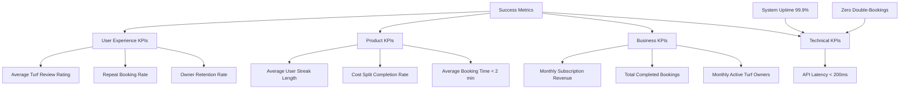

# Product Requirements Document: Turfsy

**Document Title**: Product Requirements Document (PRD) - Turfsy Smart Turf Booking Platform  
**Version**: 1.0.0  
**Document Status**: Draft (Ready for Engineering & Design Review)  
**Author**: Senior Product Manager  
**Prepared Date**: June 30, 2026  
**Platforms**: Android Mobile Application (Players), Web Dashboard (Owners), Web Admin Panel (Platform Administrators)  
**Target Market**: Mumbai, India (Phase 1)  
**Document Purpose**: To define the end-to-end functional, business, and non-functional requirements for the MVP release of Turfsy, providing a single source of truth for design, development, and quality assurance.

---

## 2. Executive Summary

### Product Overview
Turfsy is a digital sports-tech marketplace connecting recreational players with local sports turf owners. The ecosystem consists of a customer-facing Android application for finding and booking slots, a web dashboard for turf owners to run business operations, and a web admin panel for platform administration.

### Vision
To become the primary infrastructure layer for recreational sports booking and community building in urban India.

### Mission
To simplify access to sports facilities by eliminating friction in discovery, slot reservations, and payments, while empowering local turf merchants with enterprise-grade management tools.

### Business Opportunity
Urban areas like Mumbai are witnessing a massive surge in corporate leagues, amateur turf tournaments, and casual weekend football/cricket games. However, facility management remains primitive. Turfsy captures this market by moving offline business online, utilizing a double-sided platform model to optimize turf utilization rates.

### Why This Product Exists
Recreational sports booking is currently highly fragmented. Players waste hours coordinating times over WhatsApp and phone calls, while owners suffer from double-bookings, empty slots, and uncollected payments. Turfsy addresses these issues with real-time slot locks, automated group cost-splitting, and business intelligence reporting.

---

## 3. Problem Statement

### Problems Faced by Players
*   **Discovery Deficit**: No centralized repository to view sports turfs, amenities, dimensions, and live slot availability in Mumbai.
*   **Booking Friction**: Coordinating convenient times among 10-15 players and communicating with turf owners via WhatsApp/calls is inefficient.
*   **Payment Fragmentation**: Collecting individual shares of booking fees from teammates is socially awkward and manual.
*   **Loss of Deposits**: Vulnerability to losing advance cash payments when cancellations occur due to unwritten refund rules.

### Problems Faced by Turf Owners
*   **Leaked Revenue**: Double-booking errors, manual calendar mistakes, and last-minute "no-shows" lead to lost revenue.
*   **Operational Overhead**: Dealing with dozens of calls daily, checking bank screenshots, and manual logbook upkeep.
*   **Price Inflexibility**: Inability to easily deploy surge/off-peak pricing for night lights or weekends.
*   **Underutilization**: Weekday daytime slots remain empty because owners lack active marketing channels to reach nearby players.

### Problems Faced by Platform Administrators
*   **Unverified Listings**: Risk of bad actors posting fake turfs or taking deposits without possessing a physical ground.
*   **Manual Dispute Resolutions**: Managing double-booking disputes and refund escalations manually without structured data logs.
*   **Lack of Visibility**: No single interface to monitor platform health, verify cash transaction declarations, or audit billing compliance.

### Current Market Problems & Existing Solutions Limitations
Existing solutions consist of general-purpose calendar applications or spreadsheets that fail to handle the unique domain rules of sports booking:
*   They do not support dynamic day/night light transitions.
*   They lack real-time slot-locking mechanisms to prevent overlapping payment workflows.
*   They do not offer built-in team cost-splitting (Splitwise for Sports).

---

## 4. Product Goals

### Business Goals
*   Establish Turfsy as the leading sports booking brand in Mumbai within 12 months.
*   Reach 150+ verified active turf grounds on the owner portal in Phase 1.
*   Achieve an average turf slot utilization rate of 65% across listed partners.

### Product Goals
*   Provide a 3-tap booking experience for players (Search -> Select Slot -> Pay).
*   Reduce owner scheduling disputes and double-bookings to zero.
*   Create a self-service team-splitting flow that completes cost resolution in under 2 minutes.

### Technical Goals
*   Maintain a slot lock transaction consistency rate of 100%.
*   Ensure application latency remains under 200ms for availability queries.
*   Implement background queue workers to handle automated "no-show" status transitions and asynchronous expired booking cleanups.

### Customer Goals
*   Allow players to easily discover turfs within their immediate vicinity.
*   Provide clear cancellation policies and automated partial refunds.
*   Increase player engagement through streak tracking and leaderboard challenges.

### Revenue Goals
*   Onboard owners with a 2-month free trial to drive initial adoption.
*   Introduce monthly subscription plans for turf owners post-trial.
*   Generate high-margin revenue from featured placement listings.

---

## 5. Product Scope

### In Scope
*   **Android Player App**: Discovering turfs, location-based searches, slot reservation, Razorpay integration, group split-payments, profile settings, reviews, and gamification tracking.
*   **Owner Web Dashboard**: Business registration profile, turf listing management, dynamic time-of-day pricing rules, turf maintenance scheduling, calendar interfaces, secure QR code check-in validations, and revenue analytics.
*   **Platform Admin Web Panel**: Manual business verification, platform-wide user/owner moderation, booking audits, dispute resolution, featured turf management, and global platform configurations.
*   **Exclusions**: No identity document upload mechanisms (e.g., Aadhaar/PAN/KYC) are in scope. All business verifications will be conducted manually by Platform Admins based on submitted textual profiles.

### Out of Scope
*   iOS Application development.
*   Automated AI-based surge pricing models.
*   In-app chat or messaging forums between players.
*   Hardware-integrated gate access systems.

### Future Scope
*   Tournament management modules for amateur leagues.
*   Subscription passes for recurring weekly slots.
*   Equipment rental integrations (bats, balls, jerseys) at checkout.
*   In-app wallet for credits and immediate refunds.

---

## 6. User Personas

### Player Persona: "The Weekend Warrior" (Rohan, 26)
*   **Goals**: Organize weekly football matches with friends quickly, secure high-quality turfs near work/home, and ensure cost splitting is handled without manual follow-ups.
*   **Pain Points**: Tired of chasing friends for their share of the turf booking fee and losing slot deposits due to miscommunication.
*   **Behaviour**: Uses UPI extensively, coordinates sports events on WhatsApp, and plays weekly after office hours.
*   **Needs**: Real-time slot availability, instant booking confirmation, and an effortless way to share costs.
*   **Technical Knowledge**: High. Heavy user of mobile food delivery, ride-hailing, and payment apps.
*   **Motivations**: Staying fit, social connection, and friendly competition.

### Turf Owner Persona: "The Small Business Owner" (Vikram, 42)
*   **Goals**: Keep turf slots occupied, minimize booking scheduling issues, and track daily/monthly revenues without paper ledgers.
*   **Pain Points**: Customers cancelling at the last minute without paying, managing overlapping WhatsApp bookings, and keeping track of unpaid cash balances.
*   **Behaviour**: Operates the turf locally, relies on cash and direct UPI payments, and manages bookings on paper pads.
*   **Needs**: A simple desktop/tablet interface, automated booking reminders for customers, and a way to lock slots with advance deposits.
*   **Technical Knowledge**: Moderate. Comfortable with WhatsApp Business, banking apps, and basic web browsing.
*   **Motivations**: Maximizing business profits and reducing daily operational stress.

### Platform Administrator Persona: "The Operations Manager" (Priya, 30)
*   **Goals**: Maintain platform quality control, verify legitimacy of new owners/turfs, and resolve billing disputes quickly.
*   **Pain Points**: Lacking visibility into offline transactions, manually reviewing fake listings, and handling complaints about broken booking states.
*   **Behaviour**: Monitors system activity daily, audits listings, and approves payouts.
*   **Needs**: Comprehensive user/owner databases, detailed audit trails, search/filter controls, and a straightforward ticket approval queue.
*   **Technical Knowledge**: High. Expert in administrative dashboards and operations software.
*   **Motivations**: Operational efficiency and ensuring platform trust.

---

## 7. Complete Product Overview

| System / Platform | Purpose | Primary Users | Key Responsibilities | Major Modules |
| :--- | :--- | :--- | :--- | :--- |
| **Android Player App** | Mobile booking and discovery hub for players | Casual/corporate players | Discovery, slot reservations, online payments, team splits, and gamification | Auth, Discovery, Booking, Split Payment, Gamification, Profile |
| **Owner Web Dashboard** | Ground operations and business management portal | Turf owners and managers | Asset creation, custom pricing schedules, check-in validation, and revenue monitoring | Business Profile, Turf Management, Calendar, Analytics, Settings |
| **Admin Web Panel** | Platform governance, verification, and oversight | Startup operators/admins | Owner verification, listing approvals, booking audits, and featured promotion management | User/Owner Management, Audit Logs, Ticket System, Featured Placement |

---

## 8. Functional Requirements

### Android Player App

#### Authentication & Onboarding
*   **OTP Verification**: Secure login via Indian mobile numbers using a 6-digit OTP code sent via SMS.
*   **Username Generation**: Unique player username (4-20 alphanumeric characters) required for the team-splitting feature.
*   **Profile Creation**: Gather basic name, email, preferred sport (Football/Cricket), and geographic location (city, coordinates).
*   **Detailed Address Entry**: Manual entry fields (house/society name, landmark, road name) to save a home base.

#### Home, Search, & Discovery
*   **Dynamic Home Feed**: Sections for `Recent Views`, `Popular Turfs` (highest bookmarks), and `Nearby Turfs` based on current GPS location.
*   **Text Search**: Real-time partial matching on turf name keywords.
*   **Advanced Filter Screen**: Filters by city, sport category, price range, and sorting options (price low-to-high, price high-to-low, popularity, and nearest distance).
*   **Saved Turfs**: Quick bookmarking system to pin favorite grounds.

#### Booking & Payment Lifecycle
*   **Availability Inspector**: Real-time calendar lookup displaying operational hours, booked slots, and active pricing.
*   **Slot Reservation**: 5-minute database slot lock upon booking generation to prevent double-booking. (Players can book slots up to 90 days in advance).
*   **Payment Gateway Integration**: Multi-tier deposit selections powered by Razorpay (adhering to PG compliance for terms):
    *   `FULL_ONLINE`: 100% online deposit.
    *   `HALF_ONLINE_HALF_CASH`: 50% deposit online, 50% at the turf.
    *   `FULL_CASH`: 0% deposit online (auto-confirmed), 100% at the turf.
*   **Rebooking**: One-tap cloning of past booking details to a new date and time.
*   **Secure QR Check-in**: Generation of a cryptographically secure, HMAC-signed, single-use QR code for check-in verification upon arrival.
*   **Cancellation**: Self-service cancel button that checks the cancellation policy and processes refunds automatically if requested within the eligible window.

#### Group Split Payments (Splitwise for Sports)
*   **Player Selection**: Lead user adds teammates by searching their unique Turfsy usernames.
*   **Pro-Rata Calculation**: Automated equal distribution of booking costs.
*   **Custom Splits**: Editable text fields to allocate custom amounts to specific players.
*   **Split Finalization**: Lock feature to confirm the split structure and notify players of their share.
*   **Settlement Logging**: Interface for the lead user to mark teammates as `PAID` once they settle up.

#### Gamification & Leaderboard
*   **Streak Counter**: Counts consecutive days played (includes a 5-day grace period; streak decreases by 1 if inactivity exceeds 5 days).
*   **XP/Points Engine**: 10 points awarded per completed match hour.
*   **Leaderboard**: Ranked lists sorted by points, total matches, or hours played.
*   **Dynamic Nudges**: Tailored homepage prompts to motivate bookings based on leaderboard standings.

---

### Owner Web Dashboard

#### Authentication & Registration
*   **Owner Login**: Mobile number OTP login to establish access.
*   **Business Registration**: Form to submit business name, commercial address, support contact details, and payout banking credentials (UPI or Bank Account Details).
*   *Note: This profile must be manually approved by the platform administrator before the owner's turfs can accept bookings.*

#### Turf Listing & Asset Management
*   **Turf Creation Wizard**: Form to list ground details, dimensions, sports type (Football/Cricket), facilities (floodlights, parking, changing rooms, seating, cafeteria), and geographical coordinates.
*   **Image Management**: Multipart image upload for turf entrance, daytime views, and nighttime views.
*   **Status Controls & Maintenance**: Toggle turf state between `ACTIVE` and `INACTIVE`, and schedule automated turf maintenance blocks to prevent bookings during repairs.

#### Dynamic Pricing Matrix
*   **Time-of-day Pricing**: Set independent base rates for day slots and premium rates for night slots (floodlight hours).
*   **Day-of-week Rules**: Differentiate pricing between weekdays (Monday-Friday) and weekends (Saturday-Sunday).
*   **Cancellation Settings**: Set the cancellation window (e.g., must cancel 2 hours before) and refund percentages.

#### Operational Calendars & Verification
*   **Live Booking Grid**: Calendar showing real-time slot states (Reserved, Available, Blocked).
*   **Secure QR Check-in Validator**: Scanning interface to verify a customer's HMAC-signed QR code.
    *   For cash/half-cash bookings, scanning a valid QR updates the status to `COMPLETED` atomically and registers cash collected.
*   **Manual Completion**: Action button to mark fully online bookings as completed without requiring a QR scan.

#### Business Intelligence & Reporting
*   **KPI Scorecard**: Real-time display of daily/monthly revenue, booking volume, cancellation rates, and no-show stats.
*   **Visual Charts**: Line charts showing revenue trends and bar charts illustrating peak booking hours.
*   **Data Exports**: Downloadable PDF and CSV reports of business transactions.

---

### Admin Web Panel

#### Platform Governance
*   **Pending Verification Queue**: Dedicated list of newly registered turf owners awaiting manual review.
*   **Manual Owner Verification**: Action interface to review submitted business profiles and approve or restrict the business.
*   **User & Turf Moderation**: Enable/disable player profiles, suspend owner accounts, and toggle turf listing visibility.

#### Transaction & Operations Audit
*   **Master Booking Ledger**: Central database table of all bookings, payment types, statuses, and history logs.
*   **Refund Management**: Admin overrides to process manual refunds or resolve payment failures.
*   **Dispute Resolutions**: View support tickets submitted by players and owners.

#### Platform Settings & Customization
*   **Featured Turf Settings**: Select and schedule specific turfs to appear in the "Featured" sections of the player app.
*   **Global Parameters**: Configure default values for slot locks (e.g., 5 mins) and payment gateway keys.
*   **System Audit Trail**: Read-only log recording admin actions (e.g., listing approvals, user suspensions) for security audits.

---

## 9. Functional Requirements Table

| Feature ID | Feature Name | Description | Priority | Business Rules | Dependencies | Acceptance Criteria |
| :--- | :--- | :--- | :--- | :--- | :--- | :--- |
| **FR-PL-01** | OTP Authentication | Login/signup via Indian mobile number using a 6-digit SMS OTP | P0 | OTP is valid for 60 seconds. Maximum 3 resend attempts per hour. | SMS Gateway | User receives OTP, inputs it correctly, and is authenticated. |
| **FR-PL-02** | Username Creation | Allow new players to select a unique username | P0 | Alphanumeric characters and symbols `_`, `@`, `$`, `-` allowed. Length: 4-20 characters. | FR-PL-01 | Username availability checked. If unique, profile creation succeeds. |
| **FR-PL-03** | Slot Lock | Temporarily lock a turf slot during the checkout process | P0 | Lock duration is exactly 5 minutes. Reopens slot if payment is not confirmed. | DB Transaction | Slot becomes unavailable to other users immediately upon selection. |
| **FR-PL-04** | Group Splitwise | Split booking cost among multiple player accounts | P1 | Sum of individual splits must equal the total booking fee. Only creator can modify. | FR-PL-02 | Lead user adds players, splits the bill, locks the split, and updates pay status. |
| **FR-PL-05** | XP & Streak Engine | Award points and track active booking streaks | P2 | 10 XP per match hour. Streak decreases by 1 if idle for more than 5 days. | None | Completing booking awards points and updates streak on player dashboard. |
| **FR-OW-01** | Business Profile Setup | Form to collect owner and banking details | P0 | Requires bank account number, IFSC code, and business contact details. | FR-PL-01 | Owner registers business details. Profile status changes to "Pending Approval". |
| **FR-OW-02** | Dynamic Price Configuration | Define hourly price tiers based on time and day | P0 | Supports Day, Night, Weekday, and Weekend rate categories. | None | Booking system updates pricing automatically based on the configured matrix. |
| **FR-OW-03** | Check-in Verification | Scan customer QR to verify check-in and settle bookings | P0 | HMAC-signed QR is valid and unused. Auto-marks booking as completed and logs cash payments. | DB Booking | Owner scans valid QR, booking updates to completed atomically, and cash is logged. |
| **FR-AD-01** | Owner Verification | Manual admin review of business listings | P0 | Owner cannot go active or accept bookings until status is updated. | FR-OW-01 | Admin reviews pending profile, clicks approve, and turf listing goes active. |
| **FR-AD-02** | Featured Management | Set turfs to display in promotional homepage feeds | P2 | Featured turfs are pinned to the player dashboard home feed. | None | Admin adds turf to featured list, and it displays on the user home feed. |

---

## 10. User Stories

### Players (Android Application)
*   **As a** Player,  
    **I want to** search for sports turfs in my current city,  
    **So that** I can view nearby booking options without scrolling through irrelevant listings.
*   **As a** Player,  
    **I want to** filter turfs by sports type and price range,  
    **So that** I can find a ground that fits both my game and my budget.
*   **As a** Player,  
    **I want to** split the booking cost with my teammates using their usernames,  
    **So that** I do not have to manually collect payments or track who owes money.
*   **As a** Player,  
    **I want to** view my active booking streak and rank on the points leaderboard,  
    **So that** I can earn rewards and see how active I am compared to other players.
*   **As a** Player,  
    **I want to** cancel my booking and get an automated refund,  
    **So that** I do not lose my deposit when plans change unexpectedly.

### Turf Owners (Web Dashboard)
*   **As a** Turf Owner,  
    **I want to** register my business details and payout preferences online,  
    **So that** I can set up my account and start accepting digital bookings.
*   **As a** Turf Owner,  
    **I want to** set different prices for daytime and nighttime slots,  
    **So that** I can cover electricity costs for floodlights during late-evening matches.
*   **As a** Turf Owner,  
    **I want to** verify customer check-ins using a secure QR code scanner,  
    **So that** I can confirm arrivals and collect any remaining cash payments.
*   **As a** Turf Owner,  
    **I want to** view daily and monthly revenue charts,  
    **So that** I can track business performance and see which slots are most profitable.

### Administrators (Web Admin Panel)
*   **As an** Admin,  
    **I want to** review new owner registrations in a verification queue,  
    **So that** I can verify businesses manually before they go live on the platform.
*   **As an** Admin,  
    **I want to** suspend user profiles or turn off turf listings,  
    **So that** I can protect players and the platform from fraudulent listings.
*   **As an** Admin,  
    **I want to** check booking logs and audit trail histories,  
    **So that** I can resolve transaction disputes and monitor platform changes.

---

## 11. Acceptance Criteria (Given-When-Then Format)

### Scenario 1: Successful Slot Lock
*   **Given** a player is viewing the availability calendar for a specific turf,
*   **When** they select an open slot and click the book button,
*   **Then** the system locks the slot for 5 minutes, changes the slot status to reserved, and begins the checkout timer.

### Scenario 2: Slot Lock Expiration
*   **Given** a player has locked a slot and is on the checkout screen,
*   **When** the 5-minute timer expires before the player completes payment,
*   **Then** the system releases the lock and makes the slot available for other players.

### Scenario 3: Manual Business Approval by Admin
*   **Given** an owner has registered their business and added turf details,
*   **When** a platform administrator reviews the registration and clicks approve,
*   **Then** the owner's status updates to verified, and their turf listings become active.

### Scenario 4: Group Cost Splitting
*   **Given** a booking has been created and the lead user is on the split screen,
*   **When** the lead user adds two players by their usernames and clicks lock split,
*   **Then** the system splits the total booking cost equally, updates each player's profile with their pending share, and locks the split config.

### Scenario 5: Secure QR Check-in Verification
*   **Given** a player has a confirmed cash booking with an HMAC-signed QR code,
*   **When** the owner scans the valid QR code on the check-in screen,
*   **Then** the system marks the booking as completed, registers the cash transaction, and updates the player's match history.

---

## 12. Business Rules

### Booking Rules
*   Bookings must be made in 60-minute blocks matching the turf's slot duration.
*   Players cannot book slots that start in the past, and can only book slots up to 90 days in advance.
*   A single user account can book a maximum of 3 slots on a single day.

### Cancellation & Refund Rules
*   Cancellations must be made outside the turf's cancellation window (e.g., at least 2 hours before the start time) to receive a refund.
*   Approved cancellations return the turf's designated refund percentage to the original payment source, complying with a mandatory 3-day refund and 1-day return policy structure.
*   Cancellations made inside the cancellation window are not eligible for a refund.

### Slot Lock Rules
*   Locks are valid for exactly 5 minutes (300 seconds).
*   During this lock window, no other player can reserve or pay for the locked slot.
*   If payment fails or the window expires, the slot is immediately released.

### Payment Rules
*   `FULL_ONLINE`: 100% of the calculated price is paid via Razorpay during booking.
*   `HALF_ONLINE_HALF_CASH`: 50% is paid online during booking; 50% is collected in cash by the owner at check-in.
*   `FULL_CASH`: 0% paid online. 100% of the fee is collected in cash by the owner at check-in.

### Split Payment Rules
*   The booking creator (lead user) is automatically added as the first player in the split.
*   All added teammates must have registered Turfsy usernames.
*   Once a split is finalized (`isSplitDone = true`), no new players can be added or removed.
*   The lead user is responsible for marking teammates as paid when they collect cash or external UPI transfers.

### Booking Status
*   `PENDING`: Awaiting online deposit (slot locked for 5 minutes).
*   `CONFIRMED`: Deposit paid online OR booking created via cash mode.
*   `COMPLETED`: Secure QR code successfully scanned by the owner.
*   `CANCELLED`: Cancelled by the user or released asynchronously by the booking expiry queue worker.
*   `NO_SHOW`: Time slot has passed without check-in verification (status transitioned automatically via background worker).

### Notifications
*   Booking confirmations and payment status updates trigger immediate push notifications to both players and owners.
*   cancellation alerts are dispatched to the owner immediately upon a player cancellation.
*   Check-in QR code access notifications are sent to the player 1 hour before the scheduled start time.

### Owner Approval & Verification
*   Newly registered owners are placed in a restricted state and cannot activate listings.
*   Owners must provide valid banking/UPI details for payout distribution.
*   Only platform administrators can change an owner's status to verified.

### Admin Permissions
*   Admins cannot modify turf prices directly.
*   Admins can suspend turf listings or owner accounts.
*   All admin actions are recorded in a read-only audit log.

---

## 13. Non-Functional Requirements

### Performance
*   The availability calendar API must return results in less than 200ms.
*   The system must support up to 5,000 concurrent active users.
*   Database lock operations must complete in less than 50ms to prevent scheduling overlaps.

### Security
*   All data transfer must use HTTPS encryption.
*   Access tokens must use JWT with a 24-hour expiration window.
*   Sensitive banking details and API credentials must be encrypted at rest in the database.

### Scalability
*   The platform must use containerized microservices to scale resources during peak booking hours (e.g., Friday afternoons).
*   Database read replicas must be used to handle search and filtering traffic.

### Availability
*   The platform must maintain 99.9% uptime (excluding planned maintenance windows).
*   API services must be distributed across multiple availability zones.

### Accessibility
*   The Android application must support scaleable text sizes and high-contrast color themes.
*   Web dashboards must be fully responsive and work on mobile browsers, tablets, and desktops.

### Maintainability & Reliability
*   The backend service must be built with modular NestJS patterns to allow features to be updated independently.
*   Automated retry mechanisms must be used for payment webhook processing.

### Monitoring & Logging
*   Real-time system health and error rates must be tracked using monitoring tools (e.g., Sentry).
*   All critical operations (payments, status transitions) must log details, excluding personally identifiable information.

### Backup & Recovery
*   Database backups must run automatically every day.
*   The database must support point-in-time recovery up to 7 days.

---

## 14. Revenue Model

### Current Model
*   **2-Month Free Trial**: Turf owners receive a 2-month free trial upon registration to encourage listings.
*   **Monthly Subscriptions**: After the trial, owners pay a flat monthly subscription (e.g., ₹1,499/month) to keep listings active and access dashboard calendars.
*   **Featured Turfs**: Owners can pay a fee (e.g., ₹499/week) to appear in the "Featured" section on the player app homepage.
*   **Advertisements**: Space on the home screen and search pages for relevant brand ads (sports gear, energy drinks).
*   **Tournament Management**: Premium features for turf owners to run and organize local tournaments (bracket generation, team sign-ups).
*   **Player Fees**: The app is free for players. No booking commissions are charged to players during the launch phase.

---

## 15. Success Metrics

### Business KPIs
*   Number of verified, active turf grounds listed on the platform.
*   Month-over-month growth in completed bookings.
*   Subscription renewal rates for turf owners post-trial.

### Product KPIs
*   Conversion rate of users who view a turf and complete a booking.
*   Percentage of bookings that utilize the team-splitting feature.
*   Average weekly booking frequency per active player.

### Technical KPIs
*   API response latency for availability and search endpoints.
*   Percentage of payment completions processed via webhooks.
*   Uptime status of the slot lock database engine.

### User Experience KPIs
*   Average rating left on turfs post-booking.
*   Daily active users (DAU) to monthly active users (MAU) ratio.
*   Number of customer support tickets raised per 1,000 bookings.

---

## 16. Risks & Mitigation Plan

| Risk Category | Risk Description | Impact | Probability | Mitigation Strategy |
| :--- | :--- | :--- | :--- | :--- |
| **Operational** | Fake or low-quality turf listings posted by owners. | High | Medium | Implement mandatory manual admin review and approval before listings go active. |
| **Technical** | Payment gateway timeouts leaving bookings in a pending state. | High | Medium | Implement background webhook listeners and auto-check cron jobs to confirm statuses. |
| **Market** | Turf owners bypassing the platform for cash bookings to avoid fees. | Medium | High | Offer value-add dashboard features (automated customer reminders, revenue charts, calendar tools) to encourage in-system bookings. |
| **Technical** | Race conditions causing double-bookings for popular slots. | High | Low | Apply strict database constraints on turf ID, booking date, and start time combined with temporary 5-minute slot locks. |

---

## 17. MVP Scope (Version 1)

*   **Android Player App**:
    *   OTP Login & Profile Setup.
    *   Location-based Turf Search and Filter.
    *   5-minute Slot Locking.
    *   Razorpay Payment Integration (Full Online, Half Online, Full Cash).
    *   Pro-Rata Team Split Cost calculations.
    *   Basic match booking streaks.
    *   Review submission.
*   **Owner Web Dashboard**:
    *   Business onboarding form.
    *   Turf listing wizard (amenities, location, pricing rules).
    *   Live calendar grid views.
    *   Secure check-in verification using HMAC-signed QR codes.
    *   Basic daily/monthly revenue metrics.
*   **Admin Web Panel**:
    *   Owner profile verification queue.
    *   Platform-wide user and listing status controls.
    *   Master booking history log.
    *   Dispute ticket review interface.

---

## 18. Future Roadmap

### Phase 2: Engagement & Operations Scale
*   Enable tournament bracket hosting on the owner dashboard.
*   Introduce player match matchmaking to help groups find extra players.
*   Integrate slot subscription bookings for corporate leagues.

### Phase 3: Sports Ecosystem Expansion
*   Add in-app gear and beverage pre-orders during checkout.
*   Introduce dynamic demand-based pricing models for turf owners.
*   Launch the player application on iOS.

### Long-term Vision
To build a comprehensive sports platform that handles booking, local leagues, team creation, coaching services, and community events throughout India.

---

## 19. Conclusion

Turfsy aims to digitize the local sports turf market in Mumbai by replacing manual processes with an integrated scheduling and payment system. By offering real-time availability search, automated cost-splitting, and operational analytics tools, the platform addresses key pain points for both players and owners. 

This PRD establishes the requirements for the MVP release. It focuses on core scheduling and payment features while maintaining operational control through manual admin verification. This foundation allows the platform to establish a presence in Mumbai before expanding services in future releases.
